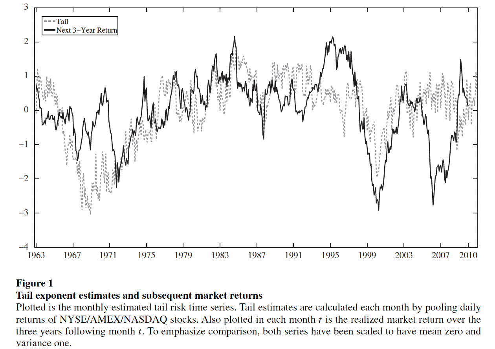

# Replicated-Tail-Risk-and-Asset-Prices

This repository provides the replicated results updated to 202212 in the paper: 'Tail Risk and Asset Prices' from RFS in 2014.

The code is contained in the ipynb files which corresponds to the results of figure 1-2 and table 1-4 in the original papers. And the replicated results are shown in the 'logs' folder. We also upload the original figure 1-2 for comparison.

## Figure 1 Tail exponent estimates and subsequent market returns

## Figure 2 Tail threshold and aggregate market volatility

Other replicated results of the first four tables are containd in the 'logs' folder.
> Table1 Market return predictability: univariate predictor performance.\
> Table2 Market return predictability: bivariate predictor performance.\
> Table3 Market return predictability: out-of-sample R2.\
> Table4 Tail beta-sorted portfolio returns.\

